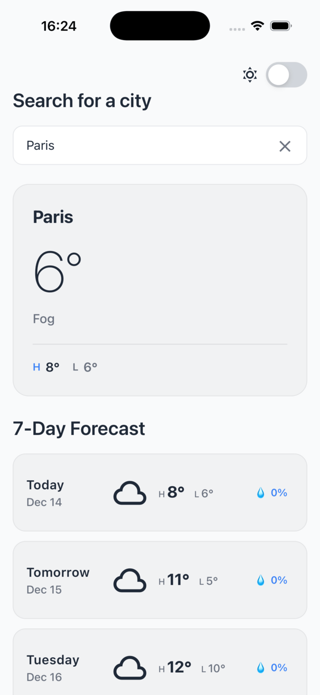

# Qvik Weather

A simple weather app built with React Native and Expo.



## Features

- 🔍 City search
- 🌡️ Current weather display
- 📅 7-day forecast
- 🌓 Dark/Light theme toggle

## Stack

- React Native & Expo
- Expo Router
- TypeScript
- TanStack React Query
- Axios
- React Native Reanimated

## Getting Started

```bash
# Install dependencies
yarn install

# Start the development server
yarn start

# Run on specific platforms
yarn ios
yarn android
```
